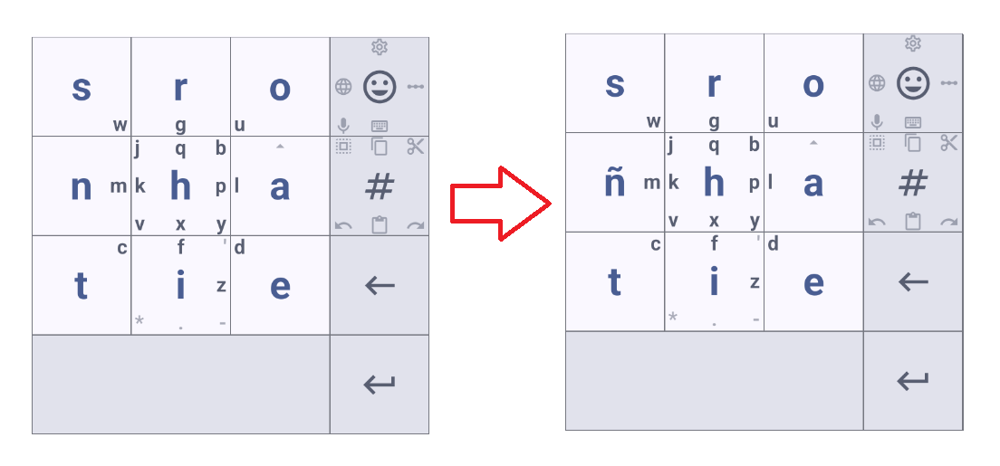
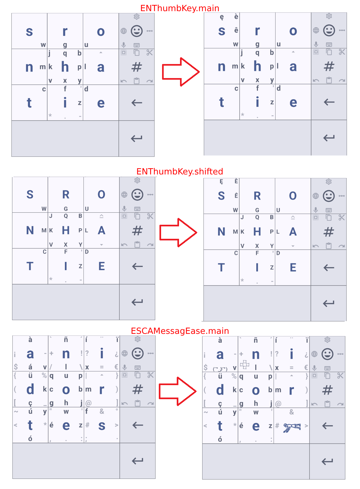

<div align="center">


[](https://woodpecker.join-lemmy.org/dessalines/thumb-key)
[](https://github.com/dessalines/thumb-key/issues)
[](LICENSE)
[](https://hosted.weblate.org/engage/thumb-key/)


</div>

<p align="center">
  <a href="https://github.com/dessalines/thumb-key" rel="noopener">
    
  </a>

<h3 align="center"><a href="https://github.com/dessalines/thumb-key">Thumb-Key</a></h3>
  <p align="center">
    A privacy-conscious keyboard made for your thumbs
    <br />
    <br />
    <a href="https://github.com/dessalines/thumb-key/issues">Report Bug</a>
    ·
    <a href="https://github.com/dessalines/thumb-key/issues">Request Feature</a>
    ·
    <a href="https://github.com/dessalines/thumb-key/releases">Releases</a>
  </p>
  <p align="center">
    <a href="https://apt.izzysoft.de/fdroid/index/apk/com.dessalines.thumbkey"></a>
    <a href="https://f-droid.org/packages/com.dessalines.thumbkey"></a>
    <a href="https://play.google.com/store/apps/details?id=com.dessalines.thumbkey"></a>
    <a href="https://github.com/dessalines/thumb-key/releases/latest"></a>
  </p>
</p>

<!-- prettier-ignore-start -->

<!-- toc -->

- [About Thumb-Key](#about-thumb-key)
  - [Features](#features)
- [User Guide](#user-guide)
  - [Emoji Key](#emoji-key)
  - [Symbols / Letters Key](#symbols--letters-key)
  - [Slide gestures](#slide-gestures)
  - [Drag-and-return](#drag-and-return)
  - [Ghost keys](#ghost-keys)
  - [Coming from MessagEase Keyboard Tips](#coming-from-messagease-keyboard-tips)
  - [Modify keys](#modify-keys)
    - [Example 1](#example-1)
    - [Example 2](#example-2)
    - [Example 3](#example-3)
    - [Example 4](#example-4)
    - [Example 5](#example-5)
    - [Example 6](#example-6)
  - [Other](#other)
- [Thumb-Key Design](#thumb-key-design)
  - [A History of Phone Keyboards](#a-history-of-phone-keyboards)
    - [When phone keyboards became Keyloggers](#when-phone-keyboards-became-keyloggers)
    - [MessagEase](#messagease)
  - [Thumb-Key Letter Positions](#thumb-key-letter-positions)
  - [Built With](#built-with)
- [Installation / Releases](#installation--releases)
- [Contributing](#contributing)
- [Support / Donate](#support--donate)
  - [Crypto](#crypto)
- [Social / Contact](#social--contact)
- [Android IME Resources](#android-ime-resources)

<!-- tocstop -->

<!-- prettier-ignore-end -->

## About Thumb-Key

Thumb-Key is a _privacy-conscious_ smart keyboard, made specifically for your thumbs.

It features a **3x3 grid layout**, and uses swipes for the less common letters. Its easy to learn, and designed for fast typing speeds.

Instead of relying on profit-driven, privacy-offending word and sentence prediction for accuracy, as do most popular phone keyboards like Gboard and Swiftkey, Thumb-Key uses **large keys with predictable positions**, to prevent your eyes from [hunting and pecking](https://www.keyboardingonline.com/hunting-and-pecking/) for letters.

As the key positions get ingrained into your muscle memory, eventually you'll be able to approximate the fast speeds of [touch-typing](https://en.m.wikipedia.org/wiki/Touch_typing), your eyes never having to leave the text edit area.

This project is a follow-up to the now unmaintained (and closed-source) [MessagEase Keyboard](https://www.exideas.com/ME/), which is its main inspiration.

### Features

- Highly configurable.
- Customizeable sizing, ThumbKey and MessagEase layouts, dynamic / Material v3 themes, animations, haptic feedback, and audio feedback.
- Open-source, [AGPL License](/LICENSE).

## User Guide

- **Tap**, or **swipe** to type a letter.
- **Swipe up** or **down** on `A` to capitalize. (If you changed the layout, the button next to `#`)
  
- **Double tap** the space bar to type a comma, triple tap to type a period. More taps have more punctuation.
- **Swipe left** or **long press** on the backspace key to delete whole words to the left of the cursor.
- **Swipe right** on the backspace key to delete whole words to the right of the cursor.
- **Swipe left** or **right** on the spacebar to move the cursor by 1 character.
- **Swipe to the bottom left** or **bottom right** on the spacebar to move the cursor by 1 word.
- **Long press** the return key to insert a line break

### Emoji Key

- **Tap** to access the emoji picker.
- **Swipe up** to configure Thumb-key.
- **Swipe right** to change keyboard position.
- **Swipe down** to access IME switcher (switch between Thumb-key and other keyboards).
- **Swipe left** to cycle between selected layouts (languages).
- **Swipe to bottom-left** to toggle voice input. Requires [FUTO Voice Input](https://play.google.com/store/apps/details?id=org.futo.voiceinput), [Transcribro](https://github.com/soupslurpr/Transcribro), or [Whisper IME](https://github.com/woheller69/whisperIME).

### Symbols / Letters Key

- **Tap** to access numbers & symbols. **Tap again** to return to letters.
- **Swipe to top-left** to select all.
- **Swipe up** to copy - If nothing is selected, all the text will be copied.
- **Swipe to top-right** to cut - If nothing is selected, all the text will be selected and cut.
- **Swipe right** to redo.
- **Swipe down** to paste.
- **Swipe left** to undo.

### Slide gestures

Enabling `Slide gestures` in keyboard settings will enable the following continuous sliding gestures:

- Slide spacebar horizontally to move cursor position left and right.
- Slide upwards while sliding the spacebar to select text.
- Slide backspace to the left to select text to be deleted. Text will be deleted when key is released.

Enabling `Spacebar: Allow normal swipes to work with slide gestures`, in keyboard settings will enable the following:

- Swipe left and right to move the cursor by a single character.
- Allow us to use the other characters on the spacebars in the typesplit layouts.

Enabling `Backspace: Allow normal swipes to work with slide gestures`, in keyboard settings will enable the following:

- Swipe left to delete whole words to the left of the cursor.
- Swipe right to delete whole words to the right of the cursor.

### Drag-and-return

- You can type the opposite-case letter by dragging away from, then back to the original key.
- Clockwise and counter-clockwise drags can be configured to type the opposite-case letter, or the equivalent center key on the numeric layout.

### Ghost keys

Enabling `Ghost keys` in keyboard settings will enable swiping hidden symbol keys without switching to the numeric layout.

### Coming from MessagEase Keyboard Tips

- For those use to tapping on the hand key to hide the MessagEase Keyboard and make more screen real estate available, this can be done by using the Android back key or on Android 10 and higher using the guesture navigation for back.
- You can use `Modify keys` and `HideKeyboard` action to achieve MessagEase experience

### Modify keys

Keyboard keys can be customized using YAML.

#### Example 1

```yaml
ENThumbKey:
  main:
    key1_0:
      center:
        text: ñ
```


This YAML configuration modifies the key in the second row, first column, center letter from 'n' to 'ñ'.

- `ENThumbKey` specifies which keyboard to change. In this case, it's the 'english thumbkey' layout.
  - [Here](./app/src/main/java/com/dessalines/thumbkey/utils/KeyboardLayout.kt) is a list of all keyboard layouts.
- `main` specifies the main keyboard layout. Possible values are:
  - `main`
  - `shifted`
  - `numeric`
  - `ctrled`
  - `alted`
- `key1_0` specifies the key to modify. The first number is the row, and the second number is the column. The top row is 0, and the left column is 0.
- `center` specifies which slide/touch direction of the key to modify. Possible values are:
  - `center`
  - `left`
  - `topLeft`
  - `top`
  - `topRight`
  - `right`
  - `bottomRight`
  - `bottom`
  - `bottomLeft`
- `text` specifies the text of the key

#### Example 2

```yaml
ENThumbKey:
  main:
    key0_0:
      right: { text: ê }
      topRight: { text: è }
      top: { text: ę }
  shifted:
    key0_0:
      right: { text: Ê }
      topRight: { text: È }
      top: { text: Ę }

ESCAMessagEase:
  main:
    key0_0:
      bottom: { text: "( ͡° ͜ʖ ͡°)", size: SMALLEST }
    key0_1:
      # Unicode escape sequence can be optionally used for convenience or readability.
      bottomLeft: { text: "\U000121EB", size: SMALL }
      # this is equivalent to:
      # bottomLeft: {text: "𒇫", size: SMALL}
    key2_2:
      swipeType: FOUR_WAY_CROSS
      center: { text: "𓀒", size: LARGE }
      topLeft: { remove: true }
      topRight: { remove: true }
      bottomRight: { remove: true }
      bottomLeft: { remove: true }
```



- Two keyboards are modified: `ENThumbKey (english thumbkey)` and `ESCAMessagEase (español català messagease)`.
- The first keyboard has both `main` and `shifted` modes modified.
- The second keyboard uses the `size` property to specify the display size of the text. Possible values are:
  - `LARGE`
  - `SMALL`
  - `SMALLEST`
- The `remove` property is used to remove key-sides.
- The `swipeType` property is used to modify the directionality of a key. Possible values are:
  - `EIGHT_WAY`
  - `FOUR_WAY_CROSS`
  - `FOUR_WAY_DIAGONAL`
  - `TWO_WAY_VERTICAL`
  - `TWO_WAY_HORIZONTAL`

#### Example 3

```yaml
ENThumbKey:
  main:
    key0_3:
      center:
        keyAction: SwitchLanguage
      left:
        keyAction: ToggleEmojiMode
```


This swaps the 'switch language' and 'toggle emoji' actions on the top-right key. Possible values for `keyAction` are:

- `ToggleNumericMode`
- `ToggleABCMode`
- `ToggleEmojiMode`
- `ToggleCapsLock`
- `ToggleShiftModeTrue`
- `ToggleShiftModeFalse`
- `ToggleCtrlModeTrue`
- `ToggleCtrlModeFalse`
- `ToggleAltModeTrue`
- `ToggleAltModeFalse`
- `Left`
- `Right`
- `Top`
- `Bottom`
- `IMEComplete`
- `PreviousWordBeforeCursor`
- `NextWordAfterCursor`
- `GotoSettings`
- `SelectAll`
- `Cut`
- `Copy`
- `Paste`
- `Undo`
- `Redo`
- `Delete`
- `DeleteWordBeforeCursor`
- `DeleteWordAfterCursor`
- `SwitchLanguage`
- `SwitchIME`
- `SwitchIMEVoice`
- `HideKeyboard`
- `Noop` # No operation. Does nothing.

`keyAction` and `text` cannot be used together.

#### Example 4

```yaml
ENThumbKey:
  main:
    key0_0: { longPress: { text: "1" } }
    key0_1: { longPress: { text: "2" } }
    key0_2: { longPress: { text: "3" } }
    key1_0: { longPress: { text: "4" } }
    key1_1: { longPress: { text: "5" } }
    key1_2: { longPress: { text: "6" } }
    key2_0: { longPress: { text: "7" } }
    key2_1: { longPress: { text: "8" } }
    key2_2: { longPress: { text: "9" } }
    key3_0: { longPress: { text: "0" } }
```

This enables long pressing to type digits. `longPress` properties are: `text`, `keyAction`, `remove`. These are used the same way as for `center`, `left`, `topLeft`, etc.

#### Example 5

This example shows one way to declare combining diacritics:

```yaml
ENMessagEase:
  main:
    key0_0:
      topLeft:
        text: "\u0301" # unicode sequence for Combining Acute Accent
        displayText: "◌́" # Dotted Circle + Combining Acute Accent
      top:
        text: "\u0302" # Combining Circumflex Accent
        displayText: "◌̂"
      topRight:
        text: "\u030b" # Combining Double Acute Accent
        displayText: "◌̋"
```

Note that the `text` field contains only one character: the combining diacritic, while the `displayText` field contains two characters: the dotted circle and the combining diacritic.

#### Example 6

```yaml
ENThumbKey:
  main:
    key0_1:
      right:
        text: "!"
        swipeReturnText: "¡" # upside-down exclamation mark, used commonly in Spanish
      key1_3:
        bottomLeft:
          swipeReturnAction: Redo
        bottomRight:
          swipeReturnAction: Undo
```

The attributes `swipeReturnText` and `swipeReturnAction` allow defining swipe-return behaviour. Possible values for `swipeReturnAction` are the same as the ones for `keyAction`.

### Other

- Practice typing, and check your words per minute, using [monkeytype.com](https://monkeytype.com)

## Thumb-Key Design

### A History of Phone Keyboards

Physical keyboards, with the full-size _QWERTY_ layout, **were not designed for use on small devices like phones**; they were designed specifically for 10 fingers resting on a keybed, sitting on a secure surface.
Phones must be held with the fore-fingers and palm, or held with one hand and typed with the other, leaving only 1 or 2 thumbs (as opposed to 10 fingers) free to perform key-presses. As texting came into being, word prediction came to be seen as the best solution to slow input speeds.

On phones that used the 9-key numeric layout, [T9 predictive text](<https://en.m.wikipedia.org/wiki/T9_(predictive_text)>) was used. Other phones used the full-hand layout with the familiar _QWERTY_ layout, with other proprietary predictive methods.

#### When phone keyboards became Keyloggers

As phones moved from physical buttons to soft-keyboards, key sizes became smaller and taps more imprecise and error-prone, with better predictive technology picking up the slack.

Smartphone companies like Apple and Google, in an attempt to better their word prediction algorithms, as well as collect potentially profitable information on what their users were typing, began submitting and aggregating all their user's key-taps to their servers, violating user's privacy in the process. [Known as Keyloggers](https://usa.kaspersky.com/resource-center/definitions/keylogger), and seen as _universally malicious_ programs on desktop computers, these apps unfortunately became normalized and seen as a necessity on phones.

The lack of innovation on phone keyboard design, is best explained by the _potential profitability_ these companies stand to gain by collecting and aggregating everything a user types; including the commodification of this data directly, or information and trends about you learned from this data, that they can sell to advertisers and 3rd parties. These could include your buying preferences, preferred websites, what you most commonly talk about with friends, and **everything you type into search bars and text boxes.**

As of today, phone keyboards are in such an abysmal state of privacy, that there aren't many keyboards left that can guarantee **not to be logging all of your keystrokes.**

#### MessagEase

As a testament to the stunning lack of innovation on both desktop and phone keyboards, the _QWERTY_ layout from the 1880s is still the dominant layout, even on smartphones in the 21st century.

One company named Exideas created a keyboard app called [MessagEase](https://www.exideas.com/ME/), which relied on the original large 9-key grid of old phones, and managed to achieve comparable fast typing speeds to other keyboards, without relying on big-data-powered word-prediction.

[Much research went into MessagEase's design](https://www.exideas.com/ME/ICMI2003Paper.pdf), and many of its users can do > 50 words per minute.

MessagEase is unfortunately unmaintained, and Thumb-Key uses a better alternating-thumb layout letter position (although the original MessagEase Keyboard layout is available in the settings).

### Thumb-Key Letter Positions

- Large keys are in a predictable 9-key grid. Eventually, you should be able to keep your eyes on the text input area, rather than hunting-and-pecking for letters, approximating touch-typing.
- Letter positions are based on [English text letter frequency](https://en.m.wikipedia.org/wiki/Letter_frequency). The most common letters are: **ETAOINSHR**. These 9 letters alone make up ~70% of all English text.
- First 9 letters by frequency are the 9 center key taps. The next 8 are swipes to the center. The next 8 are swipes on the center hub key. Z is last.
- Alternate thumbs for vowels and consonants (Vowels on right side of keyboard, consonants on left). This naturally results in fast digram speeds.
- Prioritize bottom, and right side of keyboard. So EAO should be on the right side, and bottom to top, while TNS is on the left side.

### Built With

- [Android Jetpack Compose](https://developer.android.com/jetpack/compose)

## Installation / Releases

- [Releases](https://github.com/dessalines/thumb-key/releases)
- [IzzyOnDroid](https://apt.izzysoft.de/fdroid/index/apk/com.dessalines.thumbkey)
- [F-Droid](https://f-droid.org/en/packages/com.dessalines.thumbkey/)
- [Google Play](https://play.google.com/store/apps/details?id=com.dessalines.thumbkey)

### Verifying Fingerprints

You can use [the following tool](https://developer.android.com/tools/apksigner#usage-verify) to verify the certificate before installation:

`apksigner verify -v --print-certs <path-to-apk>`

`SHA256: EA:71:95:CF:CE:63:8A:E6:B1:A8:00:2D:DC:0D:48:63:36:60:95:EA:5B:8D:95:C1:CD:5E:25:DB:0F:E2:E7:C3`

## Contributing

See [Contributing.md](CONTRIBUTING.md) for how to add keyboard layouts, and themes.

Translations via [Weblate](https://hosted.weblate.org/engage/thumb-key/):

[](https://hosted.weblate.org/engage/thumb-key/)

## Support / Donate

Thumb-Key will always remain free, open-source software. We've seen many keyboards (and open-source projects in general) go unmaintained after a few years. **Recurring donations have proven to be the only way these projects can stay alive.**

Your donations directly support full-time development, and help keep this maintained. If you find yourself using Thumb-Key every day, consider donating:

- [Support me on Liberapay](https://liberapay.com/dessalines).
- [Support me Patreon](https://www.patreon.com/dessalines).

### Crypto

- Bitcoin: `1Hefs7miXS5ff5Ck5xvmjKjXf5242KzRtK`
- Ethereum: `0x400c96c96acbC6E7B3B43B1dc1BB446540a88A01`
- Monero: `41taVyY6e1xApqKyMVDRVxJ76sPkfZhALLTjRvVKpaAh2pBd4wv9RgYj1tSPrx8wc6iE1uWUfjtQdTmTy2FGMeChGVKPQuV`

## Social / Contact

- [lemmy.ml/c/thumbkey](https://lemmy.ml/c/thumbkey)
- [Thumb-Key dev chat](https://matrix.to/#/#thumbkey-dev:matrix.org)
- [Mastodon](https://mastodon.social/@dessalines)

## Android IME Resources

- https://github.com/THEAccess/compose-keyboard-ime
- https://stackoverflow.com/questions/65570024/build-software-keyboard-with-jetpack-compose-ime-input-method-with-jetpack-com
- https://developer.android.com/develop/ui/views/touch-and-input/creating-input-method
- https://www.answertopia.com/jetpack-compose/a-jetpack-compose-in-app-purchasing-tutorial/

## Related Projects

- Alternative solution for iOS : [Wurstfinger](https://github.com/cl445/wurstfinger)
